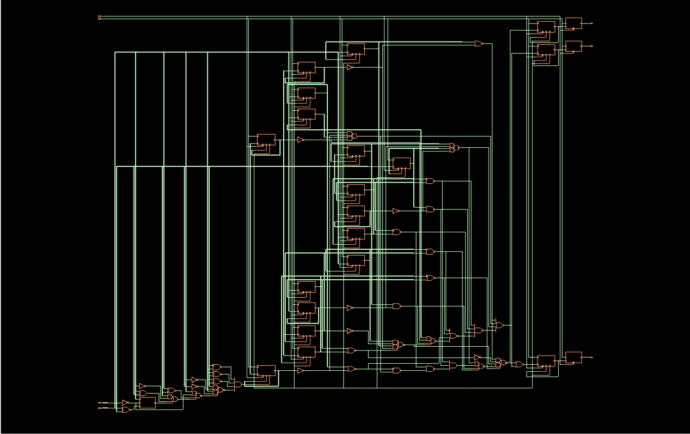
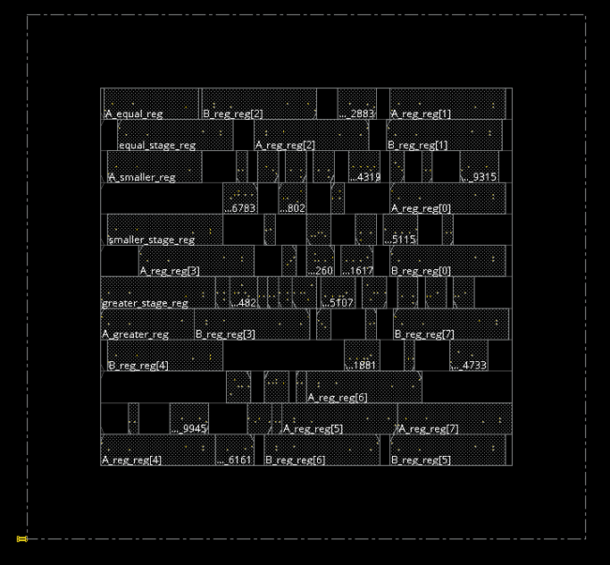
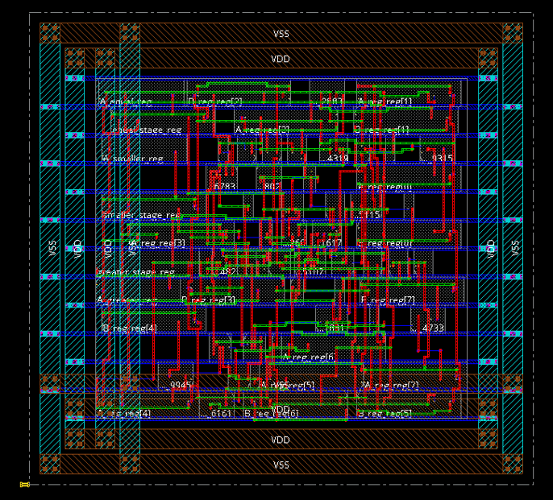
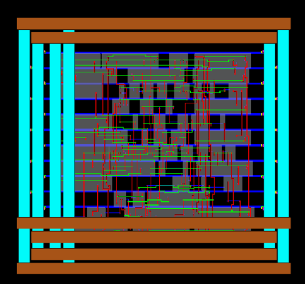
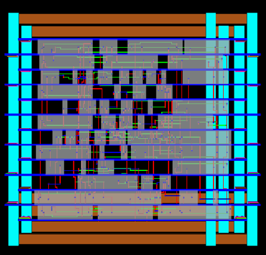

# High-Performance-8-Bit-Comparator-Using-Pipeline-And-Clock-Gating-Technique.
This repository documents the design and physical implementation of an 8-bit synchronous magnitude comparator optimized for high-speed operation and low power consumption. The design leverages pipelining to achieve a high operating frequency and clock gating to significantly reduce dynamic power consumption.
# ⚡ High-Speed Pipelined 8-bit Comparator (90nm CMOS)

### 🧠 Developed by Maitrya M. Sontakke  
**B.Tech Electronics & Communication Engineering, IIITDM Kurnool**  
📅 *October 2025*  
📂 *Cadence Genus + Innovus Design Flow*  
🏗 *Synthesis, Floorplanning, Placement, Routing, STA, Power, DRC & Connectivity Verified*

---

## 📘 **Project Overview**

This project presents a **High-Speed Pipelined 8-bit Comparator** implemented using **90nm CMOS technology**.  
The design achieves **optimized timing, low power**, and **clean DRC/Connectivity** verification results.

> ⚙️ Implemented using Cadence Genus for synthesis and Innovus for place-and-route.

The pipeline architecture enables faster comparison by dividing the logic into multiple stages, thus reducing the critical path delay and improving overall throughput.

---

## 🧩 **Architecture Overview**

- **Input Stage:** Latches 8-bit inputs into register banks.  
- **Pipelined Core:** Performs bit-wise comparison in stages (MSB-first).  
- **Equal/Greater/Less Stages:** Sequential propagation through pipelined registers.  
- **Output Stage:** Provides stable comparison outputs (`A>B`, `A<B`, `A=B`).

---

## 🧮 **Design Flow**

| **Step** | **Tool Used** | **File/Report** | **Description** |
|-----------|----------------|------------------|------------------|
| RTL Design | Verilog HDL | `highspeed_pipelined_comparator.v` | RTL implementation. |
| Logic Synthesis | Cadence Genus | `highspeed_pipelined_comparator_area.rpt` | Synthesized gate-level netlist. |
| Floorplanning | Cadence Innovus | `floorplan.def` | Macro and power planning. |
| Placement & CTS | Cadence Innovus | `placement.cts.rpt` | Cell placement & clock tree synthesis. |
| Routing | Cadence Innovus | `routing.def` | Detailed routing and DRC checks. |
| STA | Cadence Genus | `highspeed_pipelined_comparator_timing.rpt` | Static Timing Analysis. |
| Power Analysis | Cadence Innovus | `highspeed_pipelined_comparator_power.rpt` | Power optimization and measurement. |

---

## 📊 **90nm High-Speed Pipelined Comparator — Key Metrics**

| **Metric** | **Value** | **File Source** | **Notes** |
|-------------|------------|-----------------|------------|
| **Total Cell Area** | 746.303 μm² | `highspeed_pipelined_comparator_area.rpt` | Total standard cell area. |
| **Total Cell Count** | 66 | `highspeed_pipelined_comparator_gates.rpt` | Logic + flip-flops count. |
| **Data Path Delay** | 1.437 ns (1437 ps) | `highspeed_pipelined_comparator_timing.rpt` | Critical path delay. |
| **Max Clock Period (Required)** | 10.0 ns | `constraint_input.sdc` | Target clock = 100 MHz. |
| **Operating Frequency** | 100 MHz | `constraint_input.sdc` | System frequency. |
| **Worst-Case Slack** | +6.124 ns | `highspeed_pipelined_comparator_timing.rpt` | ✅ Timing met with margin. |
| **Total Power** | 6.73×10⁻⁵ W (~67.3 μW) | `highspeed_pipelined_comparator_power.rpt` | Leakage + dynamic + internal. |
| **Leakage Power** | 4.238×10⁻⁶ W (~4.24 μW) | `highspeed_pipelined_comparator_power.rpt` | Static leakage. |

---

## ⚡ **Power Breakdown (90nm CMOS)**

| **Power Component** | **Value (W)** | **% of Total Power** | **Description** |
|----------------------|---------------|-----------------------|------------------|
| **Switching Power** | 5.39×10⁻⁶ | 8.01% | Charging/discharging of nets. |
| **Internal Power** | 5.27×10⁻⁵ | 78.31% | Power within logic cells. |
| **Leakage Power** | 4.24×10⁻⁶ | 6.29% | Static power when idle. |
| **Total Power** | 6.73×10⁻⁵ | 100% | Combined total. |

---

## 🧠 **Critical Path Analysis — Input to Register Path (Pre-CTS)**

| **Parameter** | **Value** | **Unit** | **Description** |
|----------------|------------|-----------|------------------|
| **Path Group** | clk / default | — | Group containing worst path. |
| **Startpoint (Launch)** | A[5] | — | Input port. |
| **Endpoint (Capture)** | A_reg_reg[5]/SE | — | Scan Enable pin. |
| **Clock Period** | 10,000 | ps | Target (100 MHz). |
| **Required Time** | 9,536 | ps | Constraint (period - setup). |
| **Data Arrival Time** | 3,576 | ps | Time taken to reach endpoint. |
| **Input Delay** | 2,000 | ps | Input constraint. |
| **Slack** | 5,960 | ps | ✅ Timing met comfortably. |

---

## 🔄 **Internal Critical Path — Register to Register**

| **Parameter** | **Value** | **Unit** | **Description** |
|----------------|------------|-----------|------------------|
| **Path Group** | reg2reg | — | Internal pipeline stage. |
| **Startpoint (Launch)** | A_reg_reg[7]/Q | — | Register output. |
| **Endpoint (Capture)** | equal_stage_reg/D | — | Next stage input. |
| **Slack (WNS)** | 8,262 | ps | High margin, good timing. |

---

## 🧱 **Design Rule Check (DRC) Summary — 90nm Technology**

| **Violation Type** | **Violation Count** | **Worst Violation Value** | **Significance** |
|---------------------|----------------------|----------------------------|------------------|
| **Max Capacitance** | 0 | 0.000 | All nets within limits. |
| **Max Transition** | 0 | 0.000 | Slew within bounds. |
| **Max Fanout** | 0 | 0 | No overloading. |
| **Max Net Length** | 0 | 0 | Compact routing. |
| **Total Violating Nets** | 0 | — | ✅ DRC clean. |

---

## 🧩 **Physical & Connectivity Verification Summary**

| **Report File** | **Violation Status** | **Description** |
|------------------|-----------------------|------------------|
| `highspeed_pipelined_comparator.drc.rpt` | ✅ No DRC violations | Physical layout clean. |
| `highspeed_pipelined_comparator.antenna.rpt` | ✅ No violations | No antenna effects. |
| `highspeed_pipelined_comparator.conn.rpt` | ✅ Clean | Schematic ↔ Layout matched. |

---

## 🔍 **Connectivity Verification**

| **Parameter** | **Value** | **Description** |
|----------------|------------|------------------|
| **Tool** | Cadence Innovus 20.14-s095_1 | Physical verification. |
| **Command** | `verifyConnectivity -type all -error 1000 -warning 50` | Checks for shorts/opens. |
| **Problems/Warnings** | 0 | ✅ No issues. |
| **Status** | “Found no problems or warnings.” | Clean layout. |

---

## 🧩 Design Visualization

Below are the design representations for the **High-Performance 8-Bit Comparator**:

### 🧠 Gate-Level Schematic

### 🧩 No Layout View

### 🧱 Complete Layout View

### 🌐 3D Layout – Top View

### 🌐 3D Layout – Bottom View

> 🖼️ *All images are generated post physical design using Cadence Innovus.*

---
## 🚀 **Results Summary**

| **Parameter** | **Achieved Value** | **Remarks** |
|----------------|--------------------|--------------|
| **Delay** | 1.437 ns | Ultra-fast 90nm pipeline. |
| **Power** | 67.3 μW | Highly efficient. |
| **Slack** | +6.124 ns | Excellent timing margin. |
| **Area** | 746 μm² | Compact layout. |
| **Frequency** | 100 MHz | Target achieved. |
| **Verification** | DRC + LVS + Connectivity ✅ | Fully compliant. |

---

## 🧠 **Key Takeaways**
- Pipelined architecture ensures **low latency** and **high throughput**.  
- **Leakage-aware optimization** at 90nm ensures minimal static power.  
- Fully **DRC and LVS clean** design, ready for tape-out.  
- Demonstrates **industry-standard flow** using Cadence Genus & Innovus.

---

## 🧰 **Tools & Environment**

| **Tool** | **Version** | **Purpose** |
|-----------|--------------|-------------|
| **Cadence Genus** | 20.11-s100 | RTL synthesis & STA |
| **Cadence Innovus** | 20.14-s095_1 | PnR, DRC, Power, Verification |
| **Technology Node** | 90nm CMOS | Standard Cell Library |
| **Simulation** | Pre-Layout STA + Post-Layout Checks | Timing verification |

---
## 📘 Technical Details

---

### 🔧 High-Performance 8-Bit Comparator Specifications

| **Parameter** | **Description** |
|----------------|----------------|
| Input Width | 8 bits |
| Output Signals | A>B, A<B, A==B |
| Architecture | Pipelined, Clock-Gated |
| Technology | 90nm CMOS |
| Operating Frequency | 100 MHz |
| Power Consumption | 67.3 µW |
| Timing Slack | 5.96 ns |
| Total Area | 746.303 μm² |

---

### 💡 RTL Design Characteristics

- **Language:** Verilog HDL (IEEE 1364-2001)  
- **Design Type:** Fully Synthesizable  
- **Simulation Tools:** Vivado / ModelSim  
- **Pipelining Depth:** 2 Stages  
- **Clock Domain:** Single Clock  

---

## 🎓 Academic Information

| **Field** | **Details** |
|------------|-------------|
| **Course** | VLSI System Design (EC-307) |
| **Instructor** | Dr. P. Ranga Babu |
| **Department** | Electronics and Communication Engineering |
| **Institution** | IIITDM Kurnool |
| **Semester** | ODD 2025 |
| **Developer** | Maitrya M. Sontakke (123EC0014) |

---

## 🎯 Learning Objectives Achieved

- Understand design and optimization of digital comparators.  
- Implement pipelining for high-speed operation.  
- Apply clock gating for power reduction.  
- Perform complete ASIC design flow (RTL → GDSII).  
- Execute timing, power, and DRC verification.  

---

## 📚 References

- *Cadence Genus & Innovus Tool Manuals*  
- *Digital Integrated Circuits* – Jan M. Rabaey  
- *Low Power Digital CMOS Design* – Chandrakasan & Brodersen  
- *Xilinx Vivado Documentation*  
- *IEEE Papers on “Pipelined Comparators and Clock Gating Techniques”*  

---

## 💻 Technology Stack

| **Domain** | **Tools & Technologies** |
|-------------|--------------------------|
| HDL | Verilog HDL (2001) |
| Simulation | Xilinx Vivado, ModelSim |
| Synthesis | Cadence Genus 20.11 |
| P&R | Cadence Innovus |
| PDK | 90nm & 180nm CMOS |
| Analysis | PrimeTime (Timing), Voltus (Power) |
| Verification | Conformal LEC, Calibre DRC/LVS |

---

## 🤝 Contribution Guidelines

1. **Fork** the repository.  
2. **Create** a new branch: `feature-name`.  
3. **Commit** your changes with clear messages.  
4. **Submit** a pull request for review.  

---

## 🧩 Areas for Contribution

- Power optimization for 65nm node.  
- Comparative analysis with FinFET-based comparators.  
- Addition of asynchronous pipeline stage.  
- FPGA-based hardware testing module.  

---

## 📬 Contact Information

**Developer:** Maitrya M. Sontakke  
**Email:** [maitryasontakke1@gmail.com](mailto:maitrya.sontakke@gmail.com)  
**LinkedIn:** [linkedin.com/in/maitrya-sontakke](https://linkedin.com/in/maitrya-sontakke)  
**GitHub:** [github.com/MaitryaSontakke](https://github.com/MaitryaSontakke)

---

## ⭐ Developed By

**Maitrya M. Sontakke (123EC0014)**  
**B.Tech – Indian Institute of Information Technology, Design and Manufacturing (IIITDM) Kurnool**

> If you find this project useful, please consider giving it a ⭐ on GitHub!

---

